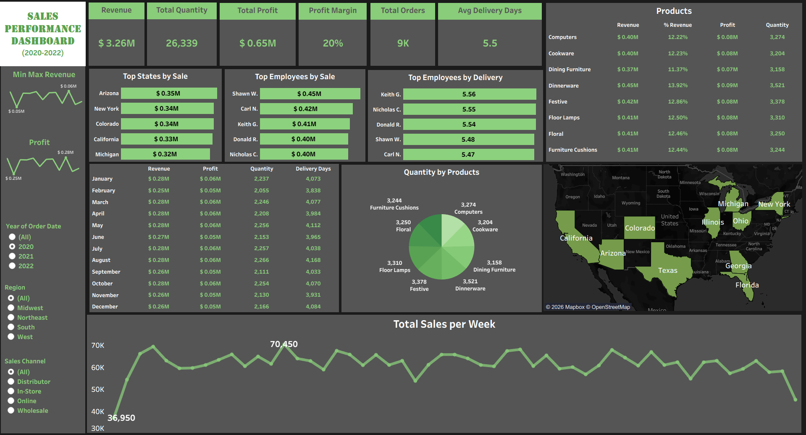

# Sales Performance Dashboard - Tableau Project

## Project Overview
This project presents an interactive Sales Dashboard created with Tableau to analyze business performance in terms of revenue, profit, orders, and delivery metrics.

The dashboard provides insights into:
- Sales trends over time
- Top-performing states and employees
- Performance by product
- Regional sales distribution

---

## STAR Method Explanation

### Situation
Businesses often struggle to see their sales performance clearly across different areas like region, employees, and products. Raw data alone can make it hard to find trends and important insights.

---

### Task
The goal was to create an interactive and visually appealing dashboard that:
- Tracks key performance indicators (KPIs)
- Identifies the best-performing regions and employees
- Analyzes product contributions
- Monitors sales trends over time

---

### Action
To achieve this, took the following steps:

- Cleaned and organized the dataset for analysis
- Created calculated fields such as:
  - Profit Margin
  - Percentage of Revenue
- Designed several visualizations:
  - KPI cards (Revenue, Profit, Orders, etc.)
  - Bar charts for top states and employees
  - Pie chart for product distribution
  - Time-series analysis for weekly sales
  - Geographic map for regional insights
- Added filters for:
  - Year
  - Region
  - Sales Channel
- Ensured consistent formatting and layout for better readability

---

### Result
The final dashboard provides:
- A complete overview of business performance
- Easy identification of:
  - Top-performing states (e.g., Arizona, New York)
  - High-performing employees
  - Best-selling product categories
- Clear visibility into:
  - Revenue: $3.26M
  - Profit: $0.65M
  - Profit Margin: 20%
- Interactive filtering for deeper analysis

---

## Key Features
- Interactive filters (Year, Region, Sales Channel)
- KPI summary cards
- Geographic sales analysis
- Insights at the product level
- Analysis of weekly sales trends

---

## Tools Used
- Tableau (Data Visualization)
- Excel / CSV (Data Source)

---

## Dashboard Preview

---

## How to Use
1. Download the `.twbx` or `.twb` file
2. Open it in Tableau Desktop or Tableau Public
3. Use filters to explore insights

---

## Learnings
- Improved dashboard design and layout
- Gained hands-on experience with calculated fields in Tableau
- Developed a better understanding of storytelling with data
- Practiced with real-world business KPIs

---

## Connect
If you found this project useful, feel free to connect or share feedback!
